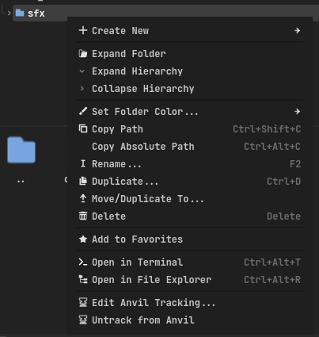
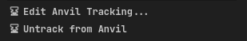
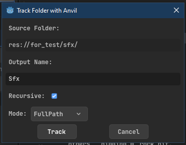

# Anvil

Anvil is a Godot 4 (C#) editor plugin that generates compile-time safe `StringName` constants for tracked project folders and for your project's global groups — so you stop typing raw string paths and group names by hand, and stop finding out about typos at runtime.

## Why

Referencing resources and groups by raw string is fragile:

```csharp
GD.Load<AudioStream>("res://sfx/planted.wav"); // typo-prone, breaks silently if the file moves
AddToGroup("enimies"); // no compiler error, just a bug
```

Anvil scans folders and project-wide global groups you choose, and generates a single `Storage` class with strongly-typed `StringName` constants for everything it finds:

```csharp
using Anvil;

GD.Load<AudioStream>(Storage.Sfx.Planted);
AddToGroup(Storage.GlobalGroups.Enemies);
```

Rename a file, delete a folder, or mistype an ID, and you get a compile error instead of a silent runtime bug.

## Features

- **Folder tracking** — right-click any folder in the FileSystem dock and choose **Track with Anvil...** to generate an ID for every file inside it.
- **Two generation modes** per tracked folder:
  - `Id` — constants are just the file's base name (`Storage.Sfx.Planted`), plus a `HintString` for use with `[Export(PropertyHint.Enum, ...)]`.
  - `FullPath` — constants are the full `res://` path to the file, useful when you need to `Load()` it directly.
- **Recursive scanning** — optionally include subfolders.
- **Global groups** — every group declared in **Project Settings → Globals → Groups** is generated automatically as `Storage.GlobalGroups.*`, no tracking required.

## Installation

1. Copy the `addons/anvil` folder into your project's `addons/` directory.
2. Enable the plugin under **Project → Project Settings → Plugins**.
3. Anvil will generate `Storage.cs` automatically on load, and again whenever you run **Generate Anvil IDs** from the **Project → Tools** menu.

## Usage

### Tracking a folder

Right-click any folder in the FileSystem dock and select **Track with Anvil...**.





You'll be asked for:

| Field | Description |
|---|---|
| **Output Name** | The name of the generated nested class, e.g. `Sfx` → `Storage.Sfx` |
| **Recursive** | Whether to include files in subfolders |
| **Mode** | `Id` or `FullPath`, as described above |



Already-tracked folders show **Edit Anvil Tracking...** and **Untrack from Anvil** instead, so you can reconfigure or stop tracking a folder at any time.

### Generating IDs

Anvil generates automatically on project load. To regenerate manually (e.g. after adding new files to a tracked folder), use **Project → Tools → Generate Anvil IDs**.

### Using generated IDs

```csharp
using Anvil;

GD.Load<AudioStream>(Storage.Sfx.Planted.ToString());
AddToGroup(Storage.GlobalGroups.Enemies);

[Export(PropertyHint.Enum, Storage.Sfx.HintString)]
public string SoundId;
```

If you're referencing IDs from one folder repeatedly in a file, `using static` drops the `Storage.` prefix:

```csharp
using static Anvil.Storage;

GD.Load<AudioStream>(Sfx.Planted.ToString());
AddToGroup(GlobalGroups.Enemies);
```

## How it works

Anvil stores your tracked-folder configuration in `res://addons/anvil/anvil_rules.tres` — a plain Godot `Resource` (`AnvilRuleSet`, containing a list of `AnvilRule`), editable either through the context menu dialog or directly in the inspector.

On generation, Anvil:

1. Loads `anvil_rules.tres`.
2. Validates every rule — skipping (with a warning) any rule with an empty output name, a duplicate output name, or a folder that no longer exists.
3. Scans each valid tracked folder (respecting the `Recursive` flag and excluding `.import`/`.uid` files).
4. Scans `project.godot` for declared global groups.
5. Writes everything into `res://addons/anvil/generated/Storage.cs`.

## File structure

```
addons/anvil/
├── plugin.cfg
├── anvil_rules.tres      # generated on first run
├── AnvilPlugin.cs
├── icons/
│   └── anvil_icon.svg
└── src/
    ├── AnvilContextMenu.cs
    ├── AnvilFileIO.cs
    ├── AnvilGenerator.cs
    ├── AnvilRule.cs
    ├── AnvilRuleManager.cs
    ├── AnvilRuleSet.cs
    ├── AnvilTrackFolderDialog.cs
    ├── AnvilValidator.cs
    └── ForgeMode.cs
```

`Storage.cs` is generated at runtime into `res://addons/anvil/generated/` — not part of the repo itself.

## Known limitations

- Renaming or moving a tracked folder in the FileSystem dock is **not** detected automatically — Anvil matches rules by exact string path, so a rename leaves the old rule pointing at a path that no longer exists (reported as a warning on generation) and the new location untracked. Re-track the new location and remove the stale rule manually.
- `Storage.cs` is regenerated in full every time — don't hand-edit it, your changes will be overwritten.

## Requirements

- Godot 4.x with .NET/Mono support (C#)

## License

MIT
